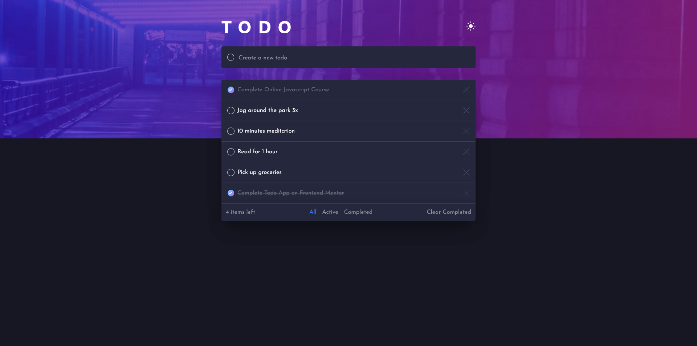

# Frontend Mentor - Todo app solution

This is a solution to the [Todo app challenge on Frontend Mentor](https://www.frontendmentor.io/challenges/todo-app-Su1_KokOW). Frontend Mentor challenges help you improve your coding skills by building realistic projects.

## Table of contents

- [Overview](#overview)
  - [The challenge](#the-challenge)
  - [Screenshot](#screenshot)
  - [Links](#links)
- [My process](#my-process)
  - [Built with](#built-with)
  - [What I learned](#what-i-learned)
  - [Continued development](#continued-development)
  - [Useful resources](#useful-resources)
- [Author](#author)

**Note: Delete this note and update the table of contents based on what sections you keep.**

## Overview

### The challenge

Users should be able to:

- View the optimal layout for the app depending on their device's screen size
- See hover states for all interactive elements on the page
- Add new todos to the list
- Mark todos as complete
- Delete todos from the list
- Filter by all/active/complete todos
- Clear all completed todos
- Toggle light and dark mode
- **Bonus**: Drag and drop to reorder items on the list

### Screenshot

Screnshots of the desktop light mode and the mobile versions can be found in the public folder

### Links

- Solution URL: [Add solution URL here](https://your-solution-url.com)
- Live Site URL: [Add live site URL here](https://your-live-site-url.com)

## My process

### Built with

- [React](https://reactjs.org/) - JS library
- [Tailwind CSS](https://tailwindcss.com/)
- Flexbox
- Mobile-first workflow

### What I learned

This challenge helped me enforce my knowledge and understanding of state and I generally became a lot more comfortable with react Js. Also it was my first project built with tailwind css so I learned a lot of tailwind too.

### Continued development

I would like to learn how to build the drag and drop feature, so this is my next challenge

### Useful resources

- [Tailwind Site](https://tailwindcss.com/) - This helped me to find all the tailwind syntax I needed to style my project
- [Gradient border with tailwind css](https://dev.to/raivikas/how-to-create-a-gradient-border-blogpostcard-using-tailwind-css-and-nextjs-57fa) - This is an amazing article which helped me make a gradient border for the checkmarks in the todo elements

## Author

- Frontend Mentor - [@jomit](https://www.frontendmentor.io/profile/jomitdev)
